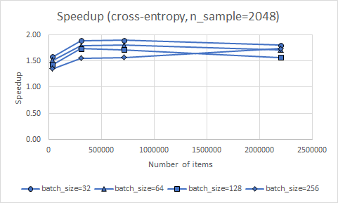
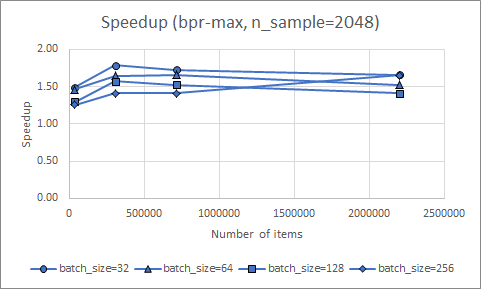
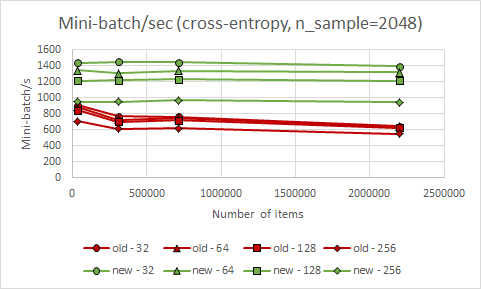
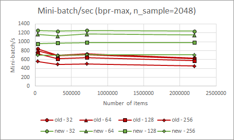
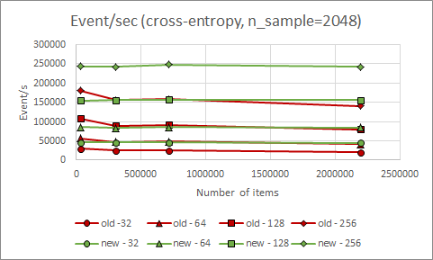
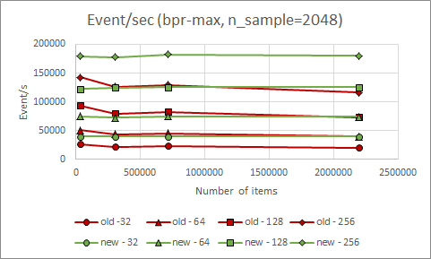

# GRU4Rec

This is the original theano implementation of the algorithm of the paper ["Session-based Recommendations With Recurrent Neural Networks"](https://arxiv.org/abs/1511.06939 "Session-based Recommendations With Recurrent Neural Networks"), with the extensions introduced in the paper ["Recurrent Neural Networks with Top-k Gains for Session-based Recommendations"](https://arxiv.org/abs/1706.03847 "Recurrent Neural Networks with Top-k Gains for Session-based Recommendations").

Make sure to always use the latest version as baseline and cite both papers when you do so!

The code was optimized for fast execution on the GPU (up to 1500 mini-batch per second on a GTX 1080Ti). According to the Theano profiler, training spends 97.5% of the time on the GPU (0.5% on CPU and 2% moving data between the two). Running on the CPU is not supported, but it is possible with some modificatons to the code.

Parameters of the experiments on the Recsys Challenge 2015 (RSC15) dataset - that is reported in the paper - can be found in `examples/rsc15/run_rsc15.py` and in `param_samples`.

You can train and evaluate the model on your own session data easily using `run.py`. Usage information below.

**LICENSING:** See license.txt for details. Main guidelines: for research and education purposes the code is and always will be free to use. Using the code or parts of it in commercial systems requires a licence. If you've been using the code or any of its derivates in a commercial system, contact me!

**CONTENTS:**  
[Requirements](#requirements "Requirements")  
  [Theano configuration](#theano-configuration "Theano configuration")  
[Usage](#usage "Usage")  
  [Execute experiments using `run.py`](#execute-experiments-using-`run.py` "Execute experiments using run.py")  
    [Examples](#examples "Examples")  
  [Using GRU4Rec in code or the interpreter](#using-gru4rec-in-code-or-the-interpreter "Using GRU4Rec in code or the interpreter")  
    [Notes on sequence-aware vs. session-based models](#notes-on-sequence-aware-vs.-session-based-models "Notes on sequence-aware vs. session-based models")  
  [Reproducing experiments on RSC15](#reproducing-experiments-on-rsc15 "Reproducing experiments on RSC15")  
[Speed of training](#speed-of-training "Speed of training")  
[Executing on CPU](#executing-on-CPU "Executing on CPU")  
[Major updates](#major-updates "Major updates")  

## Requirements

- **python** --> Use python `3.6.3` or newer. The code was mostly tested on `3.6.3` and `3.7.6`, but was briefly tested on other versions. Python 2 is NOT supported.
- **numpy** --> `1.16.4` or newer.
- **pandas** --> `0.24.2` or newer.
- **CUDA** --> Needed for the GPU support of Theano. The latest CUDA version Theano was tested with (to the best of my knowledge) is `9.2`. Might work with more recent ones, but I advise to use `9.2`.
- **libgpuarray** --> Required for the GPU support of Theano, use the latest version.
- **theano** --> `1.0.4` (last stable release) or newer (occassionally it is still updated with minor stuff). GPU support should be installed.

**Note on cuDNN** --> More recent versions produce a warning, but `7.6.4` still works for me. GRU4Rec doesn't rely heavily on the part of Theano that utilizes cuDNN. With cuDNN `v7`, some of the operators are *SLOWER* when the cuDNN version is used (e.g. [see here](https://github.com/Theano/Theano/issues/6432)). Therefore some related optimizations should be excluded in the configuration (see below).


### Theano configuration

This code was optimized for GPU execution. This means that beside execution on the CPU might be slower than what is achievable, execution will fail if you try to directly run it on CPU (if you really want to mess with it, check out the relevant section of this readme). Therefore Theano configuration must be set in a way to use the GPU. If you use `run.py` for runnning experiments, the code sets this configuration for you. You might want to change some of the preset configuration (e.g. execute on a specified GPU instead of the one with the lowest Id). You can do this in the `THEANO_FLAGS` environment variable or edit `.theanorc_gru4rec`.

If you don't use `run.py`, it is possible that the preset config won't have any effect (this happens if theano is imported before `gru4rec` either directly or by another module). In this case, you must set your own config by either editing your `.theanorc` or setting up the `THEANO_FLAGS` environment variable. Please refer to the [documentation of Theano](http://deeplearning.net/software/theano/library/config.html).

**Important config parameters**
- `device` --> must always be a CUDA capable GPU (e.g. `cuda0`).
- `floatX` --> must always be `float32`
- `mode` --> should be `FAST_RUN` for fast execution
- `optimizer_excluding` --> should be `local_dnn_reduction:local_cudnn_maxandargmax:local_dnn_argmax` to tell Theano not to use the relevant cuDNN optimizations that are slow if you have cuDNN `v7`

## Usage

### Execute experiments using `run.py`
`run.py` is an easy way to train, evaluate and save/load GRU4Rec models.

Execute with the `-h` argument to take a look at the parameters.
```
$ python run.py -h
```
Output:
```
usage: run.py [-h] [-ps PARAM_STRING] [-pf PARAM_PATH] [-l] [-s MODEL_PATH] [-t TEST_PATH [TEST_PATH ...]] [-m AT [AT ...]] [-e EVAL_TYPE] [-ss SS]
              [--sample_store_on_cpu] [--test_against_items N_TEST_ITEMS]
              PATH

Train or load a GRU4Rec model & measure recall and MRR on the specified test set(s).

positional arguments:
  PATH                  Path to the training data (TAB separated file (.tsv or .txt) or pickled pandas.DataFrame object (.pickle)) (if the --load_model parameter is NOT provided) or to the serialized model (if the --load_model parameter is provided).

optional arguments:
  -h, --help            show this help message and exit
  -ps PARAM_STRING, --parameter_string PARAM_STRING
                        Training parameters provided as a single parameter string. The format of the string is `param_name1=param_value1,param_name2=param_value2...`, e.g.: `loss=bpr-max,layers=100,constrained_embedding=True`. Boolean training parameters should be either True or False; parameters that can take a list should use / as the separator (e.g. layers=200/200). Mutually exclusive with the -pf (--parameter_file) and the -l (--load_model) arguments and one of the three must be provided.
  -pf PARAM_PATH, --parameter_file PARAM_PATH
                        Alternatively, training parameters can be set using a config file specified in this argument. The config file must contain a single OrderedDict named `gru4rec_params`. The parameters must have the appropriate type (e.g. layers = [100]). Mutually exclusive with the -ps (--parameter_string) and the -l (--load model) arguments and one of the three must be provided.
  -l, --load_model      Load an already trained model instead of training a model. Mutually exclusive with the -ps (--parameter_string) and the -pf (--parameter_file) arguments and one of the three must be provided.
  -s MODEL_PATH, --save_model MODEL_PATH
                        Save the trained model to the MODEL_PATH. (Default: don't save model)
  -t TEST_PATH [TEST_PATH ...], --test TEST_PATH [TEST_PATH ...]
                        Path to the test data set(s) located at TEST_PATH. Multiple test sets can be provided (separate with spaces). (Default: don't evaluate the model)
  -m AT [AT ...], --measure AT [AT ...]
                        Measure recall & MRR at the defined recommendation list length(s). Multiple values can be provided. (Default: 20)
  -e EVAL_TYPE, --eval_type EVAL_TYPE
                        Sets how to handle if multiple items in the ranked list have the same prediction score (which is usually due to saturation or an error). See the documentation of evaluate_gpu() in evaluation.py for further details. (Default: standard)
  -ss SS, --sample_store_size SS
                        GRU4Rec uses a buffer for negative samples during training to maximize GPU utilization. This parameter sets the buffer length. Lower values require more frequent recomputation, higher values use more (GPU) memory. Unless you know what you are doing, you shouldn't mess with this parameter. (Default: 10000000)
  --sample_store_on_cpu
                        If provided, the sample store will be stored in the RAM instead of the GPU memory. This is not advised in most cases, because it significantly lowers the GPU utilization. This option is provided if for some reason you want to train the model on the CPU (NOT advised).
  --test_against_items N_TEST_ITEMS
                        It is NOT advised to evaluate recommender algorithms by ranking a single positive item against a set of sampled negatives. It overestimates recommendation performance and also skewes comparisons, as it affects algorithms differently (and if a different sequence of random samples is used, the results are downright uncomparable). If testing takes too much time, it is advised to sample test sessions to create a smaller test set. However, if the number of items is very high (i.e. ABOVE FEW MILLIONS), it might be impossible to evaluate the model within a reasonable time, even on a smaller (but still representative) test set. In this case, and this case only, one can sample items to evaluate against. This option allows to rank the positive item against the N_TEST_ITEMS most popular items. This has a lesser effect on comparison and it is a much stronger criteria than ranking against randomly sampled items. Keep in mind that the real performcance of the algorithm will still be overestimated by the results, but comparison will be mostly fair. If used, you should NEVER SET THIS PARAMETER BELOW 50000 and try to set it as high as possible (for your required evaluation time). (Default: all items are used as negatives for evaluation)
```

#### Examples

Train and evaluate a model measuring recall and MRR at 1, 5, 10 and 20 using model parameters from a parameter string.
```
$ python run.py /path/to/training_data_file -t /path/to/test_data_file -m 1 5 10 20 -ps loss=bpr-max,final_act=elu-0.5,hidden_act=tanh,layers=100,adapt=adagrad,n_epochs=10,batch_size=32,dropout_p_embed=0.0,dropout_p_hidden=0.0,learning_rate=0.2,momentum=0.3,n_sample=2048,sample_alpha=0.0,bpreg=1.0,constrained_embedding=False
```
Output (using the RSC15 data). The value of the loss, the time of the computations and the speed of data processing (mini-batch/second & event/second) are printed on the output in each epoch.
```
Using cuDNN version 7604 on context None
Mapped name None to device cuda0: GeForce GTX 1080 Ti (0000:02:00.0)
SET   loss                    TO   bpr-max   (type: <class 'str'>)
SET   final_act               TO   elu-0.5   (type: <class 'str'>)
SET   hidden_act              TO   tanh      (type: <class 'str'>)
SET   layers                  TO   [100]     (type: <class 'list'>)
SET   adapt                   TO   adagrad   (type: <class 'str'>)
SET   n_epochs                TO   10        (type: <class 'int'>)
SET   batch_size              TO   32        (type: <class 'int'>)
SET   dropout_p_embed         TO   0.0       (type: <class 'float'>)
SET   dropout_p_hidden        TO   0.0       (type: <class 'float'>)
SET   learning_rate           TO   0.2       (type: <class 'float'>)
SET   momentum                TO   0.3       (type: <class 'float'>)
SET   n_sample                TO   2048      (type: <class 'int'>)
SET   sample_alpha            TO   0.0       (type: <class 'float'>)
SET   bpreg                   TO   1.0       (type: <class 'float'>)
SET   constrained_embedding   TO   False     (type: <class 'bool'>)
Loading training data...
Loading data from TAB separated file: /path/to/training_data_file
Started training
The dataframe is already sorted by SessionId, Time
Created sample store with 4882 batches of samples (type=GPU)
Epoch1 --> loss: 0.257018       (624.72s)       [1184.16 mb/s | 37890 e/s]
Epoch2 --> loss: 0.244611       (650.60s)       [1137.06 mb/s | 36383 e/s]
Epoch3 --> loss: 0.242729       (646.23s)       [1144.74 mb/s | 36629 e/s]
Epoch4 --> loss: 0.241872       (652.75s)       [1133.31 mb/s | 36263 e/s]
Epoch5 --> loss: 0.241344       (646.70s)       [1143.92 mb/s | 36603 e/s]
Epoch6 --> loss: 0.240963       (658.08s)       [1124.13 mb/s | 35970 e/s]
Epoch7 --> loss: 0.240663       (629.93s)       [1174.37 mb/s | 37577 e/s]
Epoch8 --> loss: 0.240424       (630.64s)       [1173.04 mb/s | 37535 e/s]
Epoch9 --> loss: 0.240225       (655.66s)       [1128.28 mb/s | 36102 e/s]
Epoch10 --> loss: 0.240039      (632.79s)       [1169.06 mb/s | 37407 e/s]
Total training time: 6453.16s
Loading test data...
Loading data from TAB separated file: /path/to/test_data_file
Starting evaluation (cut-off=1, using standard mode for tiebreaking)
Measuring Recall@1 and MRR@1
Evaluation took 3.99s
Recall@1: 0.178593 MRR@1: 0.178593
Starting evaluation (cut-off=5, using standard mode for tiebreaking)
Measuring Recall@5 and MRR@5
Evaluation took 2.24s
Recall@5: 0.481448 MRR@5: 0.288218
Starting evaluation (cut-off=10, using standard mode for tiebreaking)
Measuring Recall@10 and MRR@10
Evaluation took 2.21s
Recall@10: 0.613027 MRR@10: 0.305961
Starting evaluation (cut-off=20, using standard mode for tiebreaking)
Measuring Recall@20 and MRR@20
Evaluation took 2.24s
Recall@20: 0.720044 MRR@20: 0.313504
```

Train and save using model parameters from a parameter file (using different parameters than in the previous example).
```
$ python run.py /path/to/training_data_file -pf /path/to/parameter_file.py -s /path/to/save_model.pickle
```
Output (using the RSC15 data). Notice that the speed is similar in terms of mini-batch/second, but it is almost twice as fast in terms of event/second (and training time is almost halved). This is due to using larger mini-batches (`batch_size=64`). Mini-batch processing degrades very slowly as `batch_size` is increased, which means that event processing is much faster when larger mini-batches are used. Unfortunately, the results are usually better with smaller mini-batches (depens on the dataset and sometimes also on the loss).
```
Using cuDNN version 7604 on context None
Mapped name None to device cuda0: GeForce GTX 1080 Ti (0000:02:00.0)
Loaded parameters from file: /path/to/parameter_file.py
SET   layers                  TO   [100]           (type: <class 'list'>)
SET   loss                    TO   cross-entropy   (type: <class 'str'>)
SET   final_act               TO   softmax         (type: <class 'str'>)
SET   hidden_act              TO   tanh            (type: <class 'str'>)
SET   adapt                   TO   adagrad         (type: <class 'str'>)
SET   n_epochs                TO   10              (type: <class 'int'>)
SET   batch_size              TO   64              (type: <class 'int'>)
SET   dropout_p_embed         TO   0.0             (type: <class 'float'>)
SET   dropout_p_hidden        TO   0.4             (type: <class 'float'>)
SET   learning_rate           TO   0.2             (type: <class 'float'>)
SET   momentum                TO   0.2             (type: <class 'float'>)
SET   sample_alpha            TO   0.5             (type: <class 'float'>)
SET   n_sample                TO   2048            (type: <class 'int'>)
SET   logq                    TO   1.0             (type: <class 'float'>)
SET   constrained_embedding   TO   True            (type: <class 'bool'>)
Loading training data...
Loading data from TAB separated file: /path/to/training_data_file
Started training
The dataframe is already sorted by SessionId, Time
Created sample store with 4882 batches of samples (type=GPU)
Epoch1 --> loss: 7.180416       (334.48s)       [1105.96 mb/s | 70769 e/s]
Epoch2 --> loss: 6.916848       (348.47s)       [1061.56 mb/s | 67928 e/s]
Epoch3 --> loss: 6.889819       (341.80s)       [1082.29 mb/s | 69254 e/s]
Epoch4 --> loss: 6.876406       (353.20s)       [1047.35 mb/s | 67018 e/s]
Epoch5 --> loss: 6.868563       (353.45s)       [1046.60 mb/s | 66971 e/s]
Epoch6 --> loss: 6.864311       (380.97s)       [971.01 mb/s | 62133 e/s]
Epoch7 --> loss: 6.866572       (362.07s)       [1021.68 mb/s | 65376 e/s]
Epoch8 --> loss: 6.883779       (341.96s)       [1081.78 mb/s | 69222 e/s]
Epoch9 --> loss: 6.906769       (342.22s)       [1080.96 mb/s | 69169 e/s]
Epoch10 --> loss: 6.919822      (366.92s)       [1008.20 mb/s | 64513 e/s]
Total training time: 3568.13s
Saving trained model to: /path/to/save_model.pickle
```

Load a previously trained model and evaluate it measuring recall and MRR at 1, 5, 10 and 20 using the conservative method for tiebreaking.
```
$ python run.py /path/to/previously_saved_model.pickle -l -t /path/to/test_data_file -m 1 5 10 20 -e conservative
```
Output (using the RSC15 data)
```
Using cuDNN version 7604 on context None
Mapped name None to device cuda0: GeForce GTX 1080 Ti (0000:02:00.0)
Loading trained model from file: /path/to/previously_saved_model.pickle
Loading test data...
Loading data from TAB separated file: /path/to/test_data_file
Starting evaluation (cut-off=1, using conservative mode for tiebreaking)
Measuring Recall@1 and MRR@1
Evaluation took 11.40s
Recall@1: 0.166035 MRR@1: 0.166035
Starting evaluation (cut-off=5, using conservative mode for tiebreaking)
Measuring Recall@5 and MRR@5
Evaluation took 2.55s
Recall@5: 0.476976 MRR@5: 0.279910
Starting evaluation (cut-off=10, using conservative mode for tiebreaking)
Measuring Recall@10 and MRR@10
Evaluation took 2.54s
Recall@10: 0.609664 MRR@10: 0.297743
Starting evaluation (cut-off=20, using conservative mode for tiebreaking)
Measuring Recall@20 and MRR@20
Evaluation took 2.55s
Recall@20: 0.718756 MRR@20: 0.305424
```

### Using GRU4Rec in code or the interpreter
You can simply import the `gru4rec` module in your code or in an interpreter and use the `GRU4Rec` class to create and train models. The trained models can be evaluated by importing the `evaluation` module and using either the `evaluate_gpu` or the `evaluate_session_batch` method. The latter is deprecated and doesn't fully utilize the GPU and is therefore significantly slower. The public version of this code is mainly for running experiments (training and evaluating the algorithm on different datasets), therefore retrieving the actual predictions can be cumbersome and ineffective.

**IMPORTANT!** For the sake of convenience, the `gru4rec` module sets some important Theano parameters so that you don't have to worry about them if you are not familiar with Theano. But this only has any effect if `gru4rec` is imported *BEFORE* Theano (or any module that imports Theano) is imported. (Because once Theano is initialized, most of its configuration can't be changed. And even if Theano is reimported, the GPU is not reinitialized.) If you do it the other way around, you should set your default `.theanorc` or provide the `THEANO_FLAGS` environment variable with the appropriate configuration.

#### Notes on sequence-aware vs. session-based models
GRU4Rec is originally for session-based recommendations, where the generally short sessions are considered independent. Every time a user comes to the site, they are considered to be unknown, i.e. nothing of their history is used, even if it is known. (This setup is great for many real-life applications.) This means that when the model is evaluated, the hidden state starts from zero for each test session.

However, RNN (CNN, Transformer, etc.) based models are also a great fit for the practically less important sequance-aware personalized recommendation setup (i.e. the whole user history is used as a sequence to predict future items in the sequence). There are two main differences: 
- (1) The sequences are significantly longer in sequence-aware recommendations. This also means that BPTT (backpropagation through time) is useful in this scenario. For session-based recommendations, experiments suggest that BPTT doesn't improve the model.
- (2) Evaluation in the sequence-aware setup should be started from the last value of the hidden state (i.e. the value computed on the training portion of the user history).

Currently, neither of these are supported in the public code. These functionalities might be added later (they exist in some of my internal research repos). At the moment, you have to extend the code yourself to do this.

### Reproducing experiments on RSC15
- Download the dataset (`yoochoose-clicks.dat`) of the RecSys Challenge 2015 from the competitions's website.
- Preprocess it with `examples/rsc15/preprocess.py` to get two train/test splits: the `train_tr`/`train_valid` split can be used for hyperparameter optimization; final results are measured on the `train_full`/`test` split.
- Use either `run.py` with parameters stored in `param_samples` OR check out `examples/rsc15/run_rsc15.py` and run the appropriate code section.

## Speed of training
The training time mostly depends on the number of events and the model parameters. The following parameters affect the processing speed of events (event/s):
- `batch_size` --> The processing speed of batches (mb/s) decreases much slower than the size increase of the batch, therefore event processing speeds up as `batch_size` increases. Unfortunately, `batch_size` also affects model accuracy and smaller batches are usually better for most datasets.
- `n_sample` --> The number of negative samples up to 500-1000 doesn't affect processing speed (depending on the hardware). The default is `n_sample=2048`, but if the number of items is low, it might be lowered without loss of accuracy.
- `loss` --> `cross-entropy` is somewhat faster than `bpr-max`
- `dropout_p_embed`, `dropout_p_hidden`, `momentum` --> setting these to other than 0, training will be a little bit slower


Training speeds measured executing on a GTX 1080Ti (`n_sample=2048`)

| Dataset | #Items  | #Sessions | `batch_size` | mini-batch/s<br>`loss=bpr-max` | event/s<br>`loss=bpr-max` | Speedup*<br>`bpr-max` | mini-batch/s<br>`cross-entropy` | event/s<br>`cross-entropy` | Speedup*<br>`cross-entropy` |
|:--------|--------:|----------:|-------------:|-------------:|--------:|---------:|-------------:|--------:|---------:|
| RSC15   |  ~37.5K |    ~31.6M |           32 |      1254.13 |   40132 |     1.49 |      1431.19 |   45798 |     1.58 |
| RSC15   |  ~37.5K |    ~31.6M |           64 |      1165.66 |   74602 |     1.46 |      1340.19 |   85772 |     1.51 |
| RSC15   |  ~37.5K |    ~31.6M |          128 |       953.33 |  122026 |     1.30 |      1209.80 |  154855 |     1.43 |
| RSC15   |  ~37.5K |    ~31.6M |          256 |       699.79 |  179147 |     1.26 |       948.68 |  242863 |     1.35 |
| CLASS   |   ~307K |    ~5.48M |           32 |      1237.21 |   39591 |     1.79 |      1444.15 |   46213 |     1.89 |
| CLASS   |   ~307K |    ~5.48M |           64 |      1128.18 |   72204 |     1.65 |      1300.85 |   83254 |     1.79 |
| CLASS   |   ~307K |    ~5.48M |          128 |       971.73 |  124381 |     1.57 |      1213.59 |  155340 |     1.74 |
| CLASS   |   ~307K |    ~5.48M |          256 |       694.47 |  177784 |     1.41 |       946.41 |  242281 |     1.56 |
| VIDXL   | ~712.8K |    ~69.3M |           32 |      1253.92 |   40126 |     1.73 |      1438.82 |   46042 |     1.89 |
| VIDXL   | ~712.8K |    ~69.3M |           64 |      1174.81 |   75188 |     1.66 |      1334.61 |   85415 |     1.80 |
| VIDXL   | ~712.8K |    ~69.3M |          128 |       980.82 |  125545 |     1.52 |      1226.83 |  157034 |     1.71 |
| VIDXL   | ~712.8K |    ~69.3M |          256 |       712.12 |  182301 |     1.41 |       966.48 |  247418 |     1.57 |
| MARKET  |  ~2.19M |    ~79.3M |           32 |      1237.51 |   39600 |     1.66 |      1392.94 |   44574 |     1.80 |
| MARKET  |  ~2.19M |    ~79.3M |           64 |      1151.88 |   73720 |     1.52 |      1318.45 |   84381 |     1.71 |
| MARKET  |  ~2.19M |    ~79.3M |          128 |       980.01 |  125441 |     1.41 |      1211.01 |  155009 |     1.57 |
| MARKET  |  ~2.19M |    ~79.3M |          256 |       703.52 |  180101 |     1.65 |       944.72 |  241849 |     1.74 |

*Compared to the previously published public version

**Speedup compared to previous public version**  

  

**Mini-batch processing speed**  

  

**Event processing speed**  

  

## Executing on CPU
Some optimizations for speeding up GPU execution (e.g. custom Theano operators) prevent running the code on CPU. Since CPU execution of neural networks is already slow, I decided to abandon CPU support to speed up execution on GPU. If - for some reason - you still want to run GRU4Rec on the CPU, you need to modify the code to disable the custom GPU optimizations. You will be able to run the code on CPU, just don't expect it to be quick.

**Steps of disabling the custom GPU optimizations:**
- In `gpu_ops.py` change line `13` to `disable_custom_op = True`. This makes the functions in `gpu_ops` to return stnadard operators or operators assembled from standard operators, instead of the custom ones when the computational graph is computed.
- In `gru4rec.py` comment out line `12` containing `import custom_opt`. One of the custom operators is integrated deeper into Theano through `custom_opt`, which adds it to the optimizer that replaces operators in the computational graph. By removing this import, this operator won't be used.


## Major updates

### Update 08-05-2020
- Significant speed-up of the training by increasing GPU utilization.
- logQ normalization added (improves results when cross-entropy loss is used)
- Added `run.py` for easy experimentation.
- Extended this README. 

### Update 08-06-2018
- Refactor and cleaning.
- Speeding up execution.
- Ease of life improvements.
- Code for evaluating on GPU.

### Update 13-06-2017
- Upgraded to the v2.0 version
- Added BPR-max and TOP1-max losses for cutting edge performance (coupled with additional sampling +30% in recall & MRR over the base results)
- Sacrificed some speed on CPU for faster GPU execution

### Update 22-12-2016
- Fixed cross-entropy unstability. Very small predicted scores were rounded to 0 and thus their logarithm became NaN. Added a small epsilon (1e-24) to all scores before computing the logarithm. I got better results with this stabilized cross-entropy than with the TOP1 loss on networks with 100 hidden units.
- Added the option of using additional negative samples (besides the default, which is the other examples in the minibatch). The number of additional samples is given by the n_sample parameter. The probability of an item choosen as a sample is supp^sample_alpha, i.e. setting sample_alpha to 1 results in popularity based sampling, setting it to 0 results in uniform sampling. Using additional samples can slow down training, but depending on your config, the slowdown might not be noticable on GPU, up to 1000-2000 additional samples.
- Added an option to training to precompute a large batch of negative samples in advance. The number of int values (IDs) to be stored is determined by the sample_store parameter of the train function (default: 10M). This option is for the additional negative samples only, so only takes effect when n_sample > 0. Computing negative samples in each step results in very inefficient GPU utilization as computations are often interrupted by sample generation (which runs on the CPU). Precomputing samples for several steps in advance makes the process more efficient. However one should avoid setting the sample store too big as generating too many samples takes a long time, resulting in the GPU waiting for its completion for a long time. It also increases the memory footprint.

### Update 21-09-2016
- Optimized code for GPU execution. Training is ~2x faster now.
- Added retrain functionality.