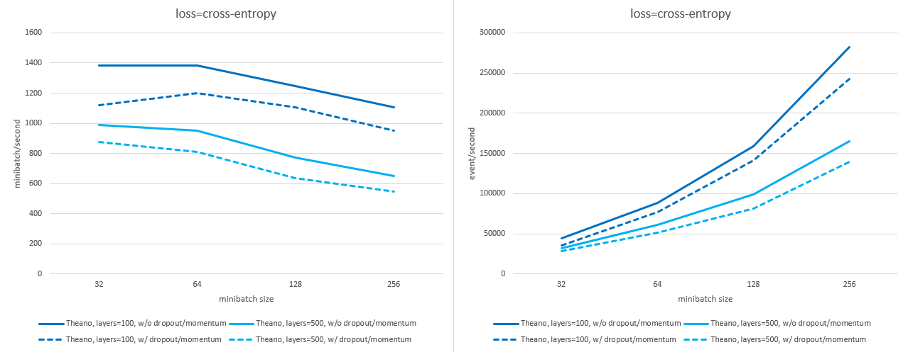
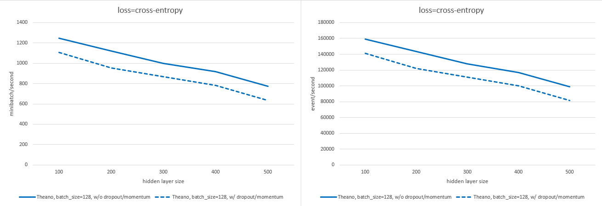
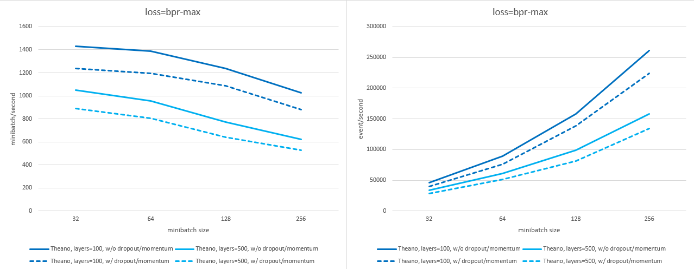
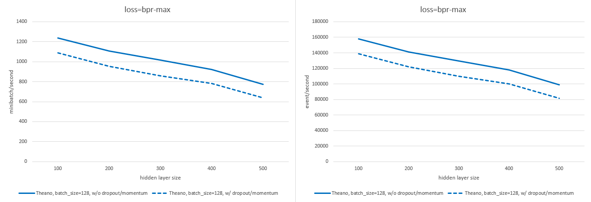

# GRU4Rec

This is the original Theano implementation of the algorithm of the paper ["Session-based Recommendations With Recurrent Neural Networks"](https://arxiv.org/abs/1511.06939 "Session-based Recommendations With Recurrent Neural Networks"), with the extensions introduced in the paper ["Recurrent Neural Networks with Top-k Gains for Session-based Recommendations"](https://arxiv.org/abs/1706.03847 "Recurrent Neural Networks with Top-k Gains for Session-based Recommendations").

Make sure to always use the latest version as baseline and cite both papers when you do so!

The code was optimized for fast execution on the GPU (up to 1500 mini-batch per second on a GTX 1080Ti). According to the Theano profiler, training spends 97.5% of the time on the GPU (0.5% on CPU and 2% moving data between the two). Running on the CPU is not supported, but it is possible with some modificatons to the code.

If you are afraid of using Theano, the following official reimplementations are also available.  
- [Official **PyTorch** version of GRU4Rec](https://github.com/hidasib/GRU4Rec_PyTorch_Official)  
- [Official **Tensorflow** version of GRU4Rec](https://github.com/hidasib/GRU4Rec_Tensorflow_Official)  

*NOTE:* These have been validated against the original, but due to how more modern deep learning frameworks operate, they are 1.5-4x slower than this version. Other reimplementations might be available in the future, depending on the research community's interest level.  
**IMPORTANT!** Avoid using unofficial reimplementations. We thorougly examined 6 third party reimplementations (PyTorch/Tensorflow, standalone/framework) in ["The Effect of Third Party Implementations on Reproducibility"](https://arxiv.org/abs/2307.14956) and all of them were flawed and/or missed important features, that resulted in up to **99% lower recommendation accuracy** and up to **335 times longer training times**. Other reimplementations we have found since then are no better.

You can train and evaluate the model on your own session data easily using `run.py`. Usage information below.

Scroll down for infromation on reproducing results on public datasets and hyperparameter tuning!

**LICENSE:** See [license.txt](license.txt) for details. Main guidelines: for research and education purposes the code is and always will be free to use. Using the code or parts of it in commercial systems requires a licence. If you've been using the code or any of its derivates in a commercial system, contact me!

**CONTENTS:**  
[Requirements](#requirements "Requirements")  
  [Theano configuration](#theano-configuration "Theano configuration")  
[Usage](#usage "Usage")  
  [Execute experiments using `run.py`](#execute-experiments-using-runpy "Execute experiments using run.py")  
    [Examples](#examples "Examples")  
  [Using GRU4Rec in code or the interpreter](#using-gru4rec-in-code-or-the-interpreter "Using GRU4Rec in code or the interpreter")  
  [Notes on sequence-aware and session-based models](#notes-on-sequence-aware-and-session-based-models "Notes on sequence-aware and session-based models")  
  [Notes on parameter settings](#notes-on-parameter-settings "Notes on parameter settings")  
[Speed of training](#speed-of-training "Speed of training")  
[Reproducing results on public datasets](#reproducing-results-on-public-datasets "Reproducing results on public datasets")  
[Hyperparameter tuning](#hyperparameter-tuning "Hyperparameter tuning")  
[Executing on CPU](#executing-on-cpu "Executing on CPU")  
[Major updates](#major-updates "Major updates")  


## Requirements

- **python** --> Use python `3.6.3` or newer. The code was mostly tested on `3.6.3`, `3.7.6` and `3.8.12`, but was briefly tested on other versions. Python 2 is NOT supported.
- **numpy** --> `1.16.4` or newer.
- **pandas** --> `0.24.2` or newer.
- **CUDA** --> Needed for the GPU support of Theano. The latest CUDA version Theano was tested with (to the best of my knowledge) is `9.2`. It works fine with more recent versions, e.g. `11.8`.
- **libgpuarray** --> Required for the GPU support of Theano, use the latest version.
- **theano** --> `1.0.5` (last stable release) or newer (occassionally it is still updated with minor stuff). GPU support should be installed.
- **optuna** --> (optional) for hyperparameter optimization, code was tested with `3.0.3`

**IMPORTANT: cuDNN** --> More recent versions produce a warning, but `8.2.1` still work for me. GRU4Rec doesn't rely heavily on the part of Theano that utilizes cuDNN. Unfortunately, `cudnnReduceTensor` in cuDNN `v7` and newer is seriously bugged, which makes operators based on this function slow and even occasionally unstable (incorrect computations or segfault) when cuDNN is used (e.g. [see here](https://github.com/Theano/Theano/issues/6432)). Therefore it is best not to use cuDNN. If you already have it installed, you can easily configure Theano to exclude cuDNN based operators (see below).  
**This bug is not related to Theano and can be reproduced from CUDA/C++. Unfortunately it hasn't been fixed for more than 6 years.*

### Theano configuration

This code was optimized for GPU execution. Executing the code will fail if you try to run it on CPU (if you really want to mess with it, check out the relevant section of this readme). Therefore Theano configuration must be set in a way to use the GPU. If you use `run.py` for runnning experiments, the code sets this configuration for you. You might want to change some of the preset configuration (e.g. execute on a specified GPU instead of the one with the lowest Id). You can do this in the `THEANO_FLAGS` environment variable or edit `.theanorc_gru4rec`.

If you don't use `run.py`, it is possible that the preset config won't have any effect (this happens if theano is imported before `gru4rec` either directly or by another module). In this case, you must set your own config by either editing your `.theanorc` or setting up the `THEANO_FLAGS` environment variable. Please refer to the [documentation of Theano](http://deeplearning.net/software/theano/library/config.html).

**Important config parameters**
- `device` --> must always be a CUDA capable GPU (e.g. `cuda0`).
- `floatX` --> must always be `float32`
- `mode` --> should be `FAST_RUN` for fast execution
- `optimizer_excluding` --> should be `local_dnn_reduction:local_cudnn_maxandargmax:local_dnn_argmax` to tell Theano not to use cuDNN based operators, because its `cudnnReduceTensor` function has been bugged since `v7`

## Usage

### Execute experiments using `run.py`
`run.py` is an easy way to train, evaluate and save/load GRU4Rec models.

Execute with the `-h` argument to take a look at the parameters.
```
$ python run.py -h
```
Output:
```
usage: run.py [-h] [-ps PARAM_STRING] [-pf PARAM_PATH] [-l] [-s MODEL_PATH] [-t TEST_PATH [TEST_PATH ...]] [-m AT [AT ...]] [-e EVAL_TYPE] [-ss SS] [--sample_store_on_cpu] [-g GRFILE] [-d D] [-ik IK] [-sk SK] [-tk TK]
              [-pm METRIC] [-lpm]
              PATH

Train or load a GRU4Rec model & measure recall and MRR on the specified test set(s).

positional arguments:
  PATH                  Path to the training data (TAB separated file (.tsv or .txt) or pickled pandas.DataFrame object (.pickle)) (if the --load_model parameter is NOT provided) or to the serialized model (if the
                        --load_model parameter is provided).

optional arguments:
  -h, --help            show this help message and exit
  -ps PARAM_STRING, --parameter_string PARAM_STRING
                        Training parameters provided as a single parameter string. The format of the string is `param_name1=param_value1,param_name2=param_value2...`, e.g.: `loss=bpr-
                        max,layers=100,constrained_embedding=True`. Boolean training parameters should be either True or False; parameters that can take a list should use / as the separator (e.g. layers=200/200).
                        Mutually exclusive with the -pf (--parameter_file) and the -l (--load_model) arguments and one of the three must be provided.
  -pf PARAM_PATH, --parameter_file PARAM_PATH
                        Alternatively, training parameters can be set using a config file specified in this argument. The config file must contain a single OrderedDict named `gru4rec_params`. The parameters must have
                        the appropriate type (e.g. layers = [100]). Mutually exclusive with the -ps (--parameter_string) and the -l (--load_model) arguments and one of the three must be provided.
  -l, --load_model      Load an already trained model instead of training a model. Mutually exclusive with the -ps (--parameter_string) and the -pf (--parameter_file) arguments and one of the three must be provided.
  -s MODEL_PATH, --save_model MODEL_PATH
                        Save the trained model to the MODEL_PATH. (Default: don't save model)
  -t TEST_PATH [TEST_PATH ...], --test TEST_PATH [TEST_PATH ...]
                        Path to the test data set(s) located at TEST_PATH. Multiple test sets can be provided (separate with spaces). (Default: don't evaluate the model)
  -m AT [AT ...], --measure AT [AT ...]
                        Measure recall & MRR at the defined recommendation list length(s). Multiple values can be provided. (Default: 20)
  -e EVAL_TYPE, --eval_type EVAL_TYPE
                        Sets how to handle if multiple items in the ranked list have the same prediction score (which is usually due to saturation or an error). See the documentation of evaluate_gpu() in evaluation.py
                        for further details. (Default: standard)
  -ss SS, --sample_store_size SS
                        GRU4Rec uses a buffer for negative samples during training to maximize GPU utilization. This parameter sets the buffer length. Lower values require more frequent recomputation, higher values
                        use more (GPU) memory. Unless you know what you are doing, you shouldn't mess with this parameter. (Default: 10000000)
  --sample_store_on_cpu
                        If provided, the sample store will be stored in the RAM instead of the GPU memory. This is not advised in most cases, because it significantly lowers the GPU utilization. This option is
                        provided if for some reason you want to train the model on the CPU (NOT advised). Note that you need to make modifications to the code so that it is able to run on CPU.
  -g GRFILE, --gru4rec_model GRFILE
                        Name of the file containing the GRU4Rec class. Can be used to select different varaiants. (Default: gru4rec)
  -ik IK, --item_key IK
                        Column name corresponding to the item IDs (detault: ItemId).
  -sk SK, --session_key SK
                        Column name corresponding to the session IDs (default: SessionId).
  -tk TK, --time_key TK
                        Column name corresponding to the timestamp (default: Time).
  -pm METRIC, --primary_metric METRIC
                        Set primary metric, recall or mrr (e.g. for paropt). (Default: recall)
  -lpm, --log_primary_metric
                        If provided, evaluation will log the value of the primary metric at the end of the run. Only works with one test file and list length.
```

#### Examples

Train, save and evaluate a model measuring recall and MRR at 1, 5, 10 and 20 using model parameters from a parameter string.
```
$ THEANO_FLAGS=device=cuda0 python run.py /path/to/training_data_file -t /path/to/test_data_file -m 1 5 10 20 -ps layers=224,batch_size=80,dropout_p_embed=0.5,dropout_p_hidden=0.05,learning_rate=0.05,momentum=0.4,n_sample=2048,sample_alpha=0.4,bpreg=1.95,logq=0.0,loss=bpr-max,constrained_embedding=True,final_act=elu-0.5,n_epochs=10 -s /path/to/save_model.pickle
```
Output (on the RetailRocket dataset):
```
Using cuDNN version 8201 on context None
Mapped name None to device cuda0: NVIDIA A30 (0000:3B:00.0)
Creating GRU4Rec model
SET   layers                  TO   [224]     (type: <class 'list'>)
SET   batch_size              TO   80        (type: <class 'int'>)
SET   dropout_p_embed         TO   0.5       (type: <class 'float'>)
SET   dropout_p_hidden        TO   0.05      (type: <class 'float'>)
SET   learning_rate           TO   0.05      (type: <class 'float'>)
SET   momentum                TO   0.4       (type: <class 'float'>)
SET   n_sample                TO   2048      (type: <class 'int'>)
SET   sample_alpha            TO   0.4       (type: <class 'float'>)
SET   bpreg                   TO   1.95      (type: <class 'float'>)
SET   logq                    TO   0.0       (type: <class 'float'>)
SET   loss                    TO   bpr-max   (type: <class 'str'>)
SET   constrained_embedding   TO   True      (type: <class 'bool'>)
SET   final_act               TO   elu-0.5   (type: <class 'str'>)
SET   n_epochs                TO   10        (type: <class 'int'>)
Loading training data...
Loading data from TAB separated file: /path/to/training_data_file
Started training
The dataframe is already sorted by SessionId, Time
Created sample store with 4882 batches of samples (type=GPU)
Epoch1 --> loss: 0.484484       (6.81s)         [1026.65 mb/s | 81386 e/s]
Epoch2 --> loss: 0.381974       (6.89s)         [1015.39 mb/s | 80493 e/s]
Epoch3 --> loss: 0.353932       (6.81s)         [1027.68 mb/s | 81468 e/s]
Epoch4 --> loss: 0.340034       (6.80s)         [1028.90 mb/s | 81564 e/s]
Epoch5 --> loss: 0.330763       (6.80s)         [1028.19 mb/s | 81508 e/s]
Epoch6 --> loss: 0.324075       (6.80s)         [1029.36 mb/s | 81601 e/s]
Epoch7 --> loss: 0.319033       (6.85s)         [1022.03 mb/s | 81020 e/s]
Epoch8 --> loss: 0.314915       (6.80s)         [1029.05 mb/s | 81577 e/s]
Epoch9 --> loss: 0.311716       (6.82s)         [1025.44 mb/s | 81290 e/s]
Epoch10 --> loss: 0.308915      (6.82s)         [1025.64 mb/s | 81306 e/s]
Total training time: 77.73s
Saving trained model to: /path/to/save_model.pickle
Loading test data...
Loading data from TAB separated file: /path/to/test_data_file
Starting evaluation (cut-off=[1, 5, 10, 20], using standard mode for tiebreaking)
Measuring Recall@1,5,10,20 and MRR@1,5,10,20
Evaluation took 4.34s
Recall@1: 0.128055 MRR@1: 0.128055
Recall@5: 0.322165 MRR@5: 0.197492
Recall@20: 0.518184 MRR@20: 0.217481
```

Train on `cuda0` using parameters from a parameter file and save the model.
```
$ THEANO_FLAGS=device=cuda0 python run.py /path/to/training_data_file -pf /path/to/parameter_file.py -s /path/to/save_model.pickle
```
Output (on the RetailRocket dataset):
```
Using cuDNN version 8201 on context None
Mapped name None to device cuda0: NVIDIA A30 (0000:3B:00.0)
Creating GRU4Rec model
SET   layers                  TO   [224]     (type: <class 'list'>)
SET   batch_size              TO   80        (type: <class 'int'>)
SET   dropout_p_embed         TO   0.5       (type: <class 'float'>)
SET   dropout_p_hidden        TO   0.05      (type: <class 'float'>)
SET   learning_rate           TO   0.05      (type: <class 'float'>)
SET   momentum                TO   0.4       (type: <class 'float'>)
SET   n_sample                TO   2048      (type: <class 'int'>)
SET   sample_alpha            TO   0.4       (type: <class 'float'>)
SET   bpreg                   TO   1.95      (type: <class 'float'>)
SET   logq                    TO   0.0       (type: <class 'float'>)
SET   loss                    TO   bpr-max   (type: <class 'str'>)
SET   constrained_embedding   TO   True      (type: <class 'bool'>)
SET   final_act               TO   elu-0.5   (type: <class 'str'>)
SET   n_epochs                TO   10        (type: <class 'int'>)
Loading training data...
Loading data from TAB separated file: /path/to/training_data_file
Started training
The dataframe is already sorted by SessionId, Time
Created sample store with 4882 batches of samples (type=GPU)
Epoch1 --> loss: 0.484484       (6.81s)         [1026.65 mb/s | 81386 e/s]
Epoch2 --> loss: 0.381974       (6.89s)         [1015.39 mb/s | 80493 e/s]
Epoch3 --> loss: 0.353932       (6.81s)         [1027.68 mb/s | 81468 e/s]
Epoch4 --> loss: 0.340034       (6.80s)         [1028.90 mb/s | 81564 e/s]
Epoch5 --> loss: 0.330763       (6.80s)         [1028.19 mb/s | 81508 e/s]
Epoch6 --> loss: 0.324075       (6.80s)         [1029.36 mb/s | 81601 e/s]
Epoch7 --> loss: 0.319033       (6.85s)         [1022.03 mb/s | 81020 e/s]
Epoch8 --> loss: 0.314915       (6.80s)         [1029.05 mb/s | 81577 e/s]
Epoch9 --> loss: 0.311716       (6.82s)         [1025.44 mb/s | 81290 e/s]
Epoch10 --> loss: 0.308915      (6.82s)         [1025.64 mb/s | 81306 e/s]
Total training time: 77.73s
Saving trained model to: /path/to/save_model.pickle
```

Load a previously trained model to `cuda1` and evaluate it measuring recall and MRR at 1, 5, 10 and 20 using the conservative method for tiebreaking.
```
$ THEANO_FLAGS=device=cuda1 python run.py /path/to/previously_saved_model.pickle -l -t /path/to/test_data_file -m 1 5 10 20 -e conservative
```
Output (on the RetailRocket dataset):
```
Using cuDNN version 8201 on context None
Mapped name None to device cuda1: NVIDIA A30 (0000:AF:00.0)
Loading trained model from file: /path/to/previously_saved_model.pickle
Loading test data...
Loading data from TAB separated file: /path/to/test_data_file
Starting evaluation (cut-off=[1, 5, 10, 20], using standard mode for tiebreaking)
Measuring Recall@1,5,10,20 and MRR@1,5,10,20
Evaluation took 4.34s
Recall@1: 0.128055 MRR@1: 0.128055
Recall@5: 0.322165 MRR@5: 0.197492
Recall@20: 0.518184 MRR@20: 0.217481
```

### Using GRU4Rec in code or the interpreter
You can simply import the `gru4rec` module in your code or in an interpreter and use the `GRU4Rec` class to create and train models. The trained models can be evaluated by importing the `evaluation` module and using either the `evaluate_gpu` or the `evaluate_session_batch` method. The latter is deprecated and doesn't fully utilize the GPU and is therefore significantly slower. The public version of this code is mainly for running experiments (training and evaluating the algorithm on different datasets), therefore retrieving the actual predictions can be cumbersome and ineffective.

**IMPORTANT!** For the sake of convenience, the `gru4rec` module sets some important Theano parameters so that you don't have to worry about them if you are not familiar with Theano. But this only has any effect if `gru4rec` is imported *BEFORE* Theano (and any module that imports Theano) is imported. (Because once Theano is initialized, most of its configuration can't be changed. And even if Theano is reimported, the GPU is not reinitialized.) If you do it the other way around, you should set your default `.theanorc` or provide the `THEANO_FLAGS` environment variable with the appropriate configuration.

### Notes on sequence-aware and session-based models
GRU4Rec is originally for session-based recommendations, where the generally short sessions are considered independent. Every time a user comes to the site, they are considered to be unknown, i.e. nothing of their history is used, even if it is known. (This setup is great for many real-life applications.) This means that when the model is evaluated, the hidden state starts from zero for each test session.

However, RNN (CNN, Transformer, etc.) based models are also a great fit for the practically less important sequence-aware personalized recommendation setup (i.e. the whole user history is used as a sequence to predict future items in the sequence). There are two main differences: 
- (1) The sequences are significantly longer in sequence-aware recommendations. This also means that BPTT (backpropagation through time) is useful in this scenario. For session-based recommendations, experiments suggest that BPTT doesn't improve the model.
- (2) Evaluation in the sequence-aware setup should be started from the last value of the hidden state (i.e. the value computed on the training portion of the user history).

Currently, neither of these are supported in the public code. These functionalities might be added later if there is enough interewst from the community (they exist in some of my internal research repos). At the moment, you have to extend the code yourself to do this.

### Notes on parameter settings
GRU4Rec has many parameters (and private versions had even more throughout the years). While you are welcome to play around with them, I found that it is usually the best to leave the following parameters on their default value.
| Parameter             | Defaults to | Comment                                                                                                               |
|--------------------|:-----------:|----------------------------------------------------------------------------------------------------------------------|
| `hidden_act`         |    `tanh`     | The activation function of the hidden layer should be tanh.                                                          |
| `lmbd`               |     `0.0`     | L2 regularization is not needed, use dropout for regularization.                                                       |
| `smoothing`          |     `0.0`     | Label smoothing for cross-entropy loss only has a minor impact on performance.                      |
| `adapt`              |   `adagrad`   | Optimizers perform similarly, with adagrad being slightly better than the others.       |
| `adapt_params`       |     `[]`      | Adagrad has no hyperparameters, therefore this is an empty list.                                                  |
| `grad_cap`           |     `0.0`     | Training works fine without gradient capping/clipping.                                               |
| `sigma`              |     `0.0`     | Setting the min/max value during weight initialization is not needed, `±sqrt(6.0/(dim[0] + dim[1]))` is used when this is 0. |
| `init_as_normal`     |    `False`    | Weights should be initialized from uniform distribution.                                                            |
| `train_random_order` |    `False`    | Training sessions should not be shuffled so that the last updates are based on recent data.                           |
| `time_sort`          |    `True`     | Training sessions should be sorted in ascending order by the timestamp of their first event (oldest session first) so that the last updates are based on recent data.        |

**Losses and final activations:**
- Among the five loss options (`cross-entropy`, `bpr-max`, `top1`, `bpr`, `top1-max`) **only `cross-entropy` or `bpr-max` should be used**. The others work to some extent, but they suffer from the vanishing gradient problem and thus produce models inferior to the ones trained with `bpr-max` or `cross-entropy`.
- `cross-entropy` has an alternative formulation `xe_logit` that requires a different final activation to be set.
- Always us the final activation (`final_act` parameter) appropriate for the loss. For `loss=cross-entropy` this is always `final_act=softmax`, for `loss=xe_logit` always use `final_act=softmax_logit`, for `loss=bpr-max` you can use either `final_act=linear`, `final_act=relu`, `final_act=tanh`, , `final_act=leaky-<X>`, `final_act=elu-<X>` or `final_act=selu-<X>-<Y>` (I usually prefer `elu-0.5` or `elu-1`).

**Embedding modes:** As it is described in the papers, there are three embedding modes that you can set as follows.
| Embedding mode | How to set | Description |
|-|-|-|
| No embedding | `embedding=0` AND `constrained_embedding=False` | The one-hot vector of the item ID is directly fed to the GRU layer. |
| Separate embedding | `embedding=X` where `X>0` or `X=layersize` AND `conmstrained_embedding=False` | Separate embedding on the input of the GRU layers and for computing the score with the sequence embedding. `embedding=layersize` sets it to the same dimensionality as the number of units in the first GRU layer. |
| Shared embedding | `constrained_embedding=True` | Usually the best performing setting. Uses the same embedding on the input of the GRU layers and for computing the scores with the sequence embedding. This enforces the dimensionality of the embedding to be equal to the size of the last GRU layer, thus the `embedding` parameter has no effect in this mode. |


## Speed of training
This version is the fastest version (by far). The speed of the official PyTorch and Tensorflow implementations are capped by the overhead introduced by the respective DL frameworks.

Time to complete one epoch (in seconds) on publicly available datasets with the best parameterization (see below), measured on an nVidia A30. The Theano version is 1.7-3 times faster than the PyTorch or Tensorflow versions.


*Details:* The short version is that Theano requires you to build a computational graph and then a Theano function needs to be created that does the computations described by the graph. During the creation of the function, the code is complied into a single (or sometimes more) C++/CUDA executables which are executed every time you call the function from Python. If you don't use any Python based operators, control doesn't need to be given back to Python which significantly lowers the overhead. The published version of GRU4Rec works on ID based representations and thus a single minibatch usually can't max out the GPU. Therefore, having the overhead of passing control between C++/CUDA and Python (as in PyTorch and Tensorflow) can significantly increase training times. This is why the difference is smaller if the layer and/or minibatch size is higher. But optimal performance sometimes requires smaller minibatches.

The training time mostly depends on the number of events and the model parameters. The following parameters affect the processing speed of events (event/s):
- `batch_size` --> The processing speed of batches (mb/s) decreases much slower than the size increase of the batch, therefore event processing speeds up as `batch_size` increases. Unfortunately, `batch_size` also affects model accuracy and smaller batches are usually better for most datasets.
- `n_sample` --> The number of negative samples up to 500-1000 doesn't affect processing speed (depending on the hardware). The default is `n_sample=2048`, but if the number of items is low, it might be lowered without loss of accuracy.
- `loss` --> `cross-entropy` is somewhat faster than `bpr-max`
- `dropout_p_embed`, `dropout_p_hidden`, `momentum` --> setting these to other than 0, training will be a little bit slower

The following figures show the difference between training speed (minibatch/second & event/second; higher is better) for various minibatch and layer sizes with and without dropout and momentum enabled, using `n_sample=2048`. Measured on an nVidia A30.

With `cross-entropy` loss:





With `bpr-max` loss:






## Reproducing results on public datasets
The performance of GRU4Rec has been measured on multiple public datasets in [1,2,3,4]: Yoochoose/RSC15, Rees46, Coveo, RetailRocket and Diginetica.

*IMPORTANT:* Measuring performance of sequential recommenders makes sense only if the data (and the task) itself shows sequential patterns, e.g. session based data. Evaluation on rating data doesn't give informative results. See [4] for details as well as for other common flaws people do during evaluation of sequential recommenders.

**Notes:**  
- Always aim to include at least one realistically large dataset in your comparison (e.g. Rees46 is a good example).
- The evaluation setup is described in detail in [1,2,3]. It is a next-item prediction type evaluation considering only the next item as relevant for a given inference. This is a good setup for behaviour prediction and correlates somewhat with online performance. It is a stricter setup than considering any of the subsequent items as relevant, which - while a perfecly reasonable setup - is more forgiving towards simplistic (e.g. counting based) methods. However, similarly to any other offline evaluation it is not a direct approximation of online performance.

**Getting the data:** Please refer to the original source of the data to obtain a full and legal copy. Links here are provided as best effort. It is not guaranteed that they won't break over time.
- [Yoochoose/RSC15](https://2015.recsyschallenge.com) or ([reupload on Kaggle](https://www.kaggle.com/datasets/chadgostopp/recsys-challenge-2015))
- [Rees46](https://www.kaggle.com/datasets/mkechinov/ecommerce-behavior-data-from-multi-category-store)
- [Coveo](https://github.com/coveooss/shopper-intent-prediction-nature-2020)
- [RetailRocket](https://www.kaggle.com/datasets/retailrocket/ecommerce-dataset)
- [Diginetica](https://competitions.codalab.org/competitions/11161#learn_the_details-data2)

**Preprocessing:**  
The details and the reasoning behind the preprocessing steps can be found in [1,2] for RSC15 and in [3] for Yoochoose, Rees46, Coveo, RetailRocket and Diginetica. Preprocessing script for RSC15 can be found in the [here](https://github.com/hidasib/GRU4Rec/blob/master/examples/rsc15/preprocess.py), and in [the repo corresponding to [3]](https://github.com/hidasib/gru4rec_third_party_comparison) for Yoochoose, Rees46, Coveo, RetailRocket and Diginetica. After running the scripts, double check if the statistics of the resulting sets match what is reported in the papers.

Preprocessing scripts yield 4 files per dataset:
- `train_full` --> full training set, used for training the model for the final evaluation 
- `test` --> test set for the final evaluation of the model (the pair of `train_full`)
- `train_tr` --> training set for hyperparameter optimization, experimentation
- `train_valid` --> validation set for hyperparameter optimization, experimentation (the pair of `train_tr`)

Basically, the full preprocessed dataset is split into `train_full` and `test`, then `train_full` is split into `train_tr` and `train_valid` using the same logic.

*IMPORTANT:* Note that while RSC15 and Yoochoose is derived from the same source (Yoochoose dataset), the preprocessing is different. The main difference is that RSC15 doesn't use deduplication. Therefore results on the two datasets are not compareable and optimal hyperparameters might differ. It is recommended to use the Yoochoose version and rely on the RSC15 version only when comparing to previously reported results if the experiment can't be reproduced for some reason (e.g. implementation of the method is not available).

[1] Balázs Hidasi, Alexandros Karatzoglou, Linas Baltrunas, Domonkos Tikk: [Session-based Recommendations with Recurrent Neural Networks](https://arxiv.org/abs/1511.06939), ICLR 2016  
[2] Balázs Hidasi, Alexandros Karatzoglou: [Recurrent Neural Networks with Top-k Gains for Session-based Recommendations](https://arxiv.org/abs/1706.03847), CIKM 2018  
[3] Balázs Hidasi, Ádám Czapp: [The Effect of Third Party Implementations on Reproducibility](https://arxiv.org/abs/2307.14956), RecSys 2023  
[4] Balázs Hidasi, Ádám Czapp: [Widespread Flaws in Offline Evaluation of Recommender Systems](https://arxiv.org/abs/2307.14951), RecSys 2023

**Hyperparameters:**  
Hyperparameters for RSC15 were obtained using a local (star) search optimizer with restarting when a better parameterization is found. It used a smaller parameter space than what is included in this repo (e.g. hidden layer size was fixed to 100). Probably there is room for some small potential improvement here with the new Optuna based optimizer.

Hyperparameters for Yoochoose, Rees46, Coveo, RetailRocket and Diginetica were obtained using the parameter spaces uploaded to this repo. 200 runs were executed per dataset, per embedding mode (no embedding, separate embedding, shared embedding) and per loss function (cross-entropy, bpr-max). The primary metric was MRR@20 that usually also gave the best results wrt. recall@20. A separate training/validation set was used during parameter optimization that was created from the full training set the same way as the (full) training/test split was created from the full dataset. Final results are measured on the test set with models trained on the full training set.

**Best hyperparameters:**  
*Note:* Parameter files (usable with the `-pf` argument of `run.py`) are [included](https://github.com/hidasib/GRU4Rec/tree/master/paramfiles) in this repo for convenience.

| Dataset | loss | constrained_embedding | embedding | elu_param | layers | batch_size | dropout_p_embed | dropout_p_hidden | learning_rate | momentum | n_sample | sample_alpha | bpreg | logq |
|---|---|---|---|---|---|---|---|---|---|---|---|---|---|---|
| RSC15 | cross-entropy | True | 0 | 0 | 100 | 32 | 0.1 | 0 | 0.1 | 0 | 2048 | 0.75 | 0 | 1 |
| Yoochoose | cross-entropy | True | 0 | 0 | 480 | 48 | 0 | 0.2 | 0.07 | 0 | 2048 | 0.2 | 0 | 1 |
| Rees46 | cross-entropy | True | 0 | 0 | 512 | 240 | 0.45 | 0 | 0.065 | 0 | 2048 | 0.5 | 0 | 1 |
| Coveo | bpr-max | True | 0 | 1 | 512 | 144 | 0.35 | 0 | 0.05 | 0.4 | 2048 | 0.2 | 1.85 | 0 |
| RetailRocket | bpr-max | True | 0 | 0.5 | 224 | 80 | 0.5 | 0.05 | 0.05 | 0.4 | 2048 | 0.4 | 1.95 | 0 |
| Diginetica | bpr-max | True | 0 | 1 | 512 | 128 | 0.5 | 0.3 | 0.05 | 0.15 | 2048 | 0.3 | 0.9 | 0 |

**Results:**  
*Note:* Due to the changes in the order of the executions of operations on the GPU, some slight variation (even up to a few percent) in the metrics is expected and acceptable.

| Dataset | Recall@1 | MRR@1 | Recall@5 | MRR@5 | Recall@10 | MRR@10 | Recall@20 | MRR@20 |
|---|---|---|---|---|---|---|---|---|
| RSC15 | 0.1845 | 0.1845 | 0.4906 | 0.2954 | 0.6218 | 0.3130 | 0.7283 | 0.3205 |
| Yoochoose | 0.1829 | 0.1829 | 0.4478 | 0.2783 | 0.5715 | 0.2949 | 0.6789 | 0.3024 |
| Rees46 | 0.1114 | 0.1114 | 0.3010 | 0.1778 | 0.4135 | 0.1928 | 0.5293 | 0.2008 |
| Coveo | 0.0513 | 0.0513 | 0.1496 | 0.0852 | 0.2212 | 0.0946 | 0.3135 | 0.1010 |
| ReatilRocket |  0.1274 | 0.1274 | 0.3237 | 0.1977 | 0.4207 | 0.2107 | 0.5186 | 0.2175 |
| Diginetica | 0.0725 | 0.0725 | 0.2369 | 0.1288 | 0.3542 | 0.1442 | 0.4995 | 0.1542 |

## Hyperparameter tuning
Hyperparameter optimization on new datasets is supported by `paropt.py`. Internally it uses [Optuna](https://optuna.org/) and requires a defined parameter space. A few predefined parameter spaces are [included](https://github.com/hidasib/GRU4Rec/tree/master/paramspaces) in this repo.

**Recommendations:**
- Run between 100 and 200 iterations with the included parameter spaces.
- Run separate optimizations when using different losses and embedding modes (no embedding (i.e. `embedding=0,constrained_embedding=False`), separate embedding (i.e. `embedding=layersize,constrained_embedding=False`) and shared embedding (i.e. `embedding=0,constrained_embedding=True`)).

**Fixed parameters:** You can play around with these as well in the optimizer, however the following fixed settings have worked well in the past.  
- `logq` --> Cross-entropy loss usually works the best with `logq=1`, the parameter has no effect when the BPR-max loss is used.
- `n_sample` --> Based on experience, `n_sample=2048` is large enough to get good performance up to a few millions of items and not too large to significantly degrade the speed of training. However, you might want to lower this if the total number of active items is below 5-10K.
- `n_epochs` --> This is usually set to `n_epochs=10`, but `5` gets you similar performance in most cases. So far there hasn't been any reason to significantly increase the number of epochs.
- embedding mode --> Full paropt needs to check all three options separately, but in the past, shared embedding (`constrained_embedding=True` and `embedding=0`) worked the best for most datasets.
- `loss` --> Full paropt needs to check both separately, but past experience indicates BPR-max to perform better on smaller and cross-entropy to perform better on larger datasets.
- `final_act` --> Always use the final activation appropriate for the loss, e.g. `final_act=softmax` when `loss=cross-entropy` and either `elu-<x>`, `linear` or `relu` when `loss=bpr-max`.

**Usage:**
```
$ python paropt.py -h
```

Output:
```
usage: paropt.py [-h] [-g GRFILE] [-tf [FLAGS]] [-fp PARAM_STRING] [-opf PATH] [-m [AT]] [-nt [NT]] [-fm [AT [AT ...]]] [-pm METRIC] [-e EVAL_TYPE] [-ik IK] [-sk SK] [-tk TK] PATH TEST_PATH

Train or load a GRU4Rec model & measure recall and MRR on the specified test set(s).

positional arguments:
  PATH                  Path to the training data (TAB separated file (.tsv or .txt) or pickled pandas.DataFrame object (.pickle)) (if the --load_model parameter is NOT provided) or to the serialized model (if the --load_model parameter
                        is provided).
  TEST_PATH             Path to the test data set(s) located at TEST_PATH.

optional arguments:
  -h, --help            show this help message and exit
  -g GRFILE, --gru4rec_model GRFILE
                        Name of the file containing the GRU4Rec class. Can be sued to select different varaiants. (Default: gru4rec)
  -tf [FLAGS], --theano_flags [FLAGS]
                        Theano settings.
  -fp PARAM_STRING, --fixed_parameters PARAM_STRING
                        Fixed training parameters provided as a single parameter string. The format of the string is `param_name1=param_value1,param_name2=param_value2...`, e.g.: `loss=bpr-max,layers=100,constrained_embedding=True`.
                        Boolean training parameters should be either True or False; parameters that can take a list should use / as the separator (e.g. layers=200/200). Mutually exclusive with the -pf (--parameter_file) and the -l
                        (--load_model) arguments and one of the three must be provided.
  -opf PATH, --optuna_parameter_file PATH
                        File describing the parameter space for optuna.
  -m [AT], --measure [AT]
                        Measure recall & MRR at the defined recommendation list length. A single values can be provided. (Default: 20)
  -nt [NT], --ntrials [NT]
                        Number of optimization trials to perform (Default: 50)
  -fm [AT [AT ...]], --final_measure [AT [AT ...]]
                        Measure recall & MRR at the defined recommendation list length(s) after the optimization is finished. Multiple values can be provided. (Default: 20)
  -pm METRIC, --primary_metric METRIC
                        Set primary metric, recall or mrr (e.g. for paropt). (Default: recall)
  -e EVAL_TYPE, --eval_type EVAL_TYPE
                        Sets how to handle if multiple items in the ranked list have the same prediction score (which is usually due to saturation or an error). See the documentation of evaluate_gpu() in evaluation.py for further
                        details. (Default: standard)
  -ik IK, --item_key IK
                        Column name corresponding to the item IDs (detault: ItemId).
  -sk SK, --session_key SK
                        Column name corresponding to the session IDs (default: SessionId).
  -tk TK, --time_key TK
                        Column name corresponding to the timestamp (default: Time).
```

**Example:** Run a hyperparater optimization optimizing for MRR@20 for 200 iterations and measuring recall and MRR at 1, 5, 10 and 20 for the best variant after optimization is finished.
*NOTE:* The paropt script can run on the CPU (`THEANO_FLAGS=device=cpu`) as models are trained in separate processes. You can control which device these training processes use by setting `-tf` argument that passes its value to the `THEANO_FLAGS` environment variable for the taining processes. In this example, training(s) are executed on `cuda0`.
```
THEANO_FLAGS=device=cpu python paropt.py /path/to/training_data_file_for_optimization /path/to/valiadation_data_file_for_optimization -pm mrr -m 20 -fm 1 5 10 20 -e conservative -fp n_sample=2048,logq=1.0,loss=cross-entropy,final_act=softmax,constrained_embedding=True,n_epochs=10 -tf device=cuda0 -opf /path/to/parameter_space.json -n 200
```
Output (first few lines):
```
--------------------------------------------------------------------------------
PARAMETER SPACE
        PARAMETER layers         type=int        range=[64..512] (step=32)       UNIFORM scale
        PARAMETER batch_size     type=int        range=[32..256] (step=16)       UNIFORM scale
        PARAMETER learning_rate          type=float      range=[0.01..0.25] (step=0.005)         UNIFORM scale
        PARAMETER dropout_p_embed        type=float      range=[0.0..0.5] (step=0.05)    UNIFORM scale
        PARAMETER dropout_p_hidden       type=float      range=[0.0..0.7] (step=0.05)    UNIFORM scale
        PARAMETER momentum       type=float      range=[0.0..0.9] (step=0.05)    UNIFORM scale
        PARAMETER sample_alpha   type=float      range=[0.0..1.0] (step=0.1)     UNIFORM scale
--------------------------------------------------------------------------------
[I 2023-07-25 03:19:53,684] A new study created in memory with name: no-name-83fade3e-49f3-4f26-ac76-5f6cb2f3a02c
SET   n_sample                TO   2048                   (type: <class 'int'>)
SET   logq                    TO   1.0                    (type: <class 'float'>)
SET   loss                    TO   cross-entropy          (type: <class 'str'>)
SET   final_act               TO   softmax                (type: <class 'str'>)
SET   constrained_embedding   TO   True                   (type: <class 'bool'>)
SET   n_epochs                TO   2                      (type: <class 'int'>)
SET   layers                  TO   [96]                   (type: <class 'list'>)
SET   batch_size              TO   176                    (type: <class 'int'>)
SET   learning_rate           TO   0.045000000000000005   (type: <class 'float'>)
SET   dropout_p_embed         TO   0.25                   (type: <class 'float'>)
SET   dropout_p_hidden        TO   0.25                   (type: <class 'float'>)
SET   momentum                TO   0.0                    (type: <class 'float'>)
SET   sample_alpha            TO   0.9                    (type: <class 'float'>)
Loading training data...
```

**Notes:** 
- By default, Optuna logs to stderr and the model prints to stdout. You can use this to log the model training details and the summary of the optimization separately by adding `1> /path/to/model_training_details.log 2> /path/to/optimization.log` to your command. Alternatively, you can play around with Optuna's settings. GRU4Rec at the moment doesn't use proper logging (it just prints).
- If you redirect stderr and/or stdout to file(s) and you want to see progress in real time, use python in unbuffered mode, by adding the `-u` argument after `python` (i.e. `python -u paropt.py ...`).

## Executing on CPU
Some optimizations for speeding up GPU execution (e.g. custom Theano operators) prevent running the code on CPU. Since CPU execution of neural networks is already slow, I decided to abandon CPU support to speed up execution on GPU. If - for some reason - you still want to run GRU4Rec on the CPU, you need to modify the code to disable the custom GPU optimizations. You will be able to run the code on CPU, just don't expect it to be quick.

**Steps of disabling the custom GPU optimizations:**
- In `gpu_ops.py` change line `13` to `disable_custom_op = True`. This makes the functions in `gpu_ops` to return standard operators or operators assembled from standard operators, instead of the custom ones when the computational graph is computed.
- In `gru4rec.py` comment out line `12` containing `import custom_opt`. One of the custom operators is integrated deeper into Theano through `custom_opt`, which adds it to the optimizer that replaces operators in the computational graph. By removing this import, this operator won't be used.


## Major updates

### Update 24-08-2023
- Added paropt
- Extended info on reproducibility
- Added parameter files and parameter spaces
- Extended readme

### Update 08-05-2020
- Significant speed-up of the training by increasing GPU utilization.
- logQ normalization added (improves results when cross-entropy loss is used)
- Added `run.py` for easy experimentation.
- Extended this README. 

### Update 08-06-2018
- Refactor and cleaning.
- Speeding up execution.
- Ease of life improvements.
- Code for evaluating on GPU.

### Update 13-06-2017
- Upgraded to the v2.0 version
- Added BPR-max and TOP1-max losses for cutting edge performance (coupled with additional sampling +30% in recall & MRR over the base results)
- Sacrificed some speed on CPU for faster GPU execution

### Update 22-12-2016
- Fixed cross-entropy unstability. Very small predicted scores were rounded to 0 and thus their logarithm became NaN. Added a small epsilon (1e-24) to all scores before computing the logarithm. I got better results with this stabilized cross-entropy than with the TOP1 loss on networks with 100 hidden units.
- Added the option of using additional negative samples (besides the default, which is the other examples in the minibatch). The number of additional samples is given by the n_sample parameter. The probability of an item choosen as a sample is supp^sample_alpha, i.e. setting sample_alpha to 1 results in popularity based sampling, setting it to 0 results in uniform sampling. Using additional samples can slow down training, but depending on your config, the slowdown might not be noticable on GPU, up to 1000-2000 additional samples.
- Added an option to training to precompute a large batch of negative samples in advance. The number of int values (IDs) to be stored is determined by the sample_store parameter of the train function (default: 10M). This option is for the additional negative samples only, so only takes effect when n_sample > 0. Computing negative samples in each step results in very inefficient GPU utilization as computations are often interrupted by sample generation (which runs on the CPU). Precomputing samples for several steps in advance makes the process more efficient. However one should avoid setting the sample store too big as generating too many samples takes a long time, resulting in the GPU waiting for its completion for a long time. It also increases the memory footprint.

### Update 21-09-2016
- Optimized code for GPU execution. Training is ~2x faster now.
- Added retrain functionality.